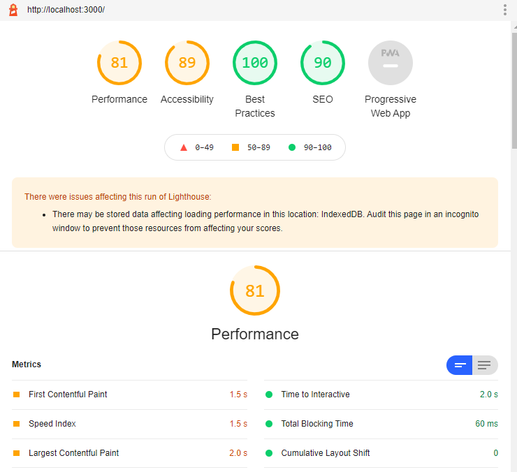

This is a starter template for [Learn Next.js](https://nextjs.org/learn).

## Career Url

http://localhost:3000/about/career

## Posts Ids Url

http://localhost:3000/posts/123
http://localhost:3000/posts/456
http://localhost:3000/posts/789

## About Url

http://localhost:3000/about

## Blog Url

http://localhost:3000/blog

## Contact Url with Typescript

touch tsconfig.json

npm install --save-dev typescript @types/react @types/node

http://localhost:3000/contact

## Deploy

npm run build

## Lighthouse result

  

